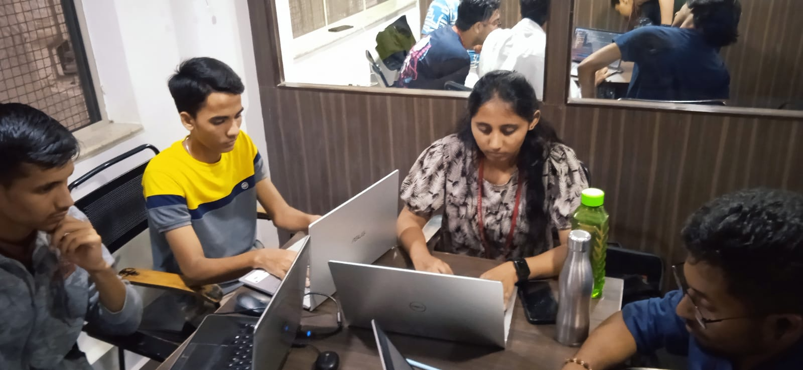

# Natasha.ai — Your AI Personal Productivity Mentor



> **Voice and text activated AI assistant that revolutionizes daily life management**

---

## 🏆 Our First Hackathon!

**Built at New Horizon College of Engineering (NHCE), Bengaluru**  
**Date:** 25 August 2023

This project was born at our very first hackathon! Four passionate developers came together at NHCE Bangalore to build something meaningful — an AI-driven personal assistant that helps people boost their productivity and take control of their daily lives.

### 👥 Team Members

| Name | GitHub |
|------|--------|
| Kupendra | [@kupendrav](https://github.com/kupendrav) |
| Mohammed Faizan | [@mohdfaizan5](https://github.com/mohdfaizan5) |
| Likitha Nagaraj | [@likithanagaraj](https://github.com/likithanagaraj) |
| Mohammed Tahir | [@muhammedtahir1](https://github.com/muhammedtahir1) |
| Akshay Sekhar | [@akshsekhr2702](https://github.com/akshsekhr2702) |

---

## 💡 What is Natasha?

Natasha is an **AI-integrated personal assistant** that serves as a supportive guide and mentor for self-development and productivity. It's designed for students and professionals who want to increase their productivity and manage their time efficiently.

Rather than just being another chatbot, Natasha is an **emotionally connected AI mentor** that:
- Tracks your activities and suggests improvements
- Provides personalized productivity tools
- Offers guidance for both personal development and career growth
- Responds with warmth and emotional awareness
- Supports voice and text-based interaction

---

## 🚀 Features

### Core Capabilities
- **Voice Activated** — Speak naturally and Natasha understands
- **AI Chat Integration** — Powered by OpenAI for intelligent conversations
- **Emotionally Aware** — Responds with empathy and encouragement
- **Psychologically Appealing UI** — Calming purple theme with smooth GSAP animations

### Productivity Tools
- ⏱️ **Pomodoro Timer** — Focus sessions with break management
- ✅ **Smart To-Do List** — Priority-based task management
- 🧘 **Meditation App** — Guided relaxation and mindfulness
- 📈 **Forgetting Curve** — Spaced repetition for better memory
- 📊 **Dashboard** — Track and visualize your productivity data

### Quick Commands
- `"Open Pomodoro"` — Start a focus session
- `"Open To-do"` — Manage your tasks
- `"Open Dashboard"` — View your productivity stats
- `"Play [song name]"` — Play music on Spotify/YouTube
- `"Search for [topic]"` — Quick Google search
- `"Open meditation app"` — Start a meditation session
- `"Suggest me some meals"` — Get meal ideas
- `"Today's weather report"` — Check the weather

---

## 🎨 Design

- **Theme:** Dark background with light purple gradients
- **Color Palette:**
  - Background: `rgb(17, 24, 39)`
  - Primary Purple: `rgb(147, 51, 234)`
  - Gradient: `rgb(92,74,150)` → `rgb(162,134,213)`
  - Text: White / `rgb(209, 213, 219)`
- **Animations:** GSAP-powered smooth transitions and scroll-triggered effects
- **Custom Cursor:** Animated purple cursor with hover effects

---

## 🛠️ Tech Stack

- HTML5 / CSS3 / Vanilla JavaScript
- [GSAP](https://greensock.com/gsap/) — Animation library
- Web Speech API — Voice recognition & synthesis
- OpenAI API — AI-powered responses
- Font Awesome — Icons

---

## 📁 Project Structure

```
natasha-ai/
├── index.html                  # Main landing page
├── readme.md
├── static/
│   ├── about.html              # About page
│   ├── assets/
│   │   ├── fonts/
│   │   └── images/
│   │       └── image.png       # Hackathon team photo
│   ├── css/
│   │   ├── general.css
│   │   ├── style.css
│   │   ├── nav&footer.css
│   │   ├── about.css
│   │   └── index.css
│   └── js/
│       ├── main.js
│       ├── commands.js
│       ├── speechRecognition.js
│       ├── openai.js
│       ├── gsap-animations.js
│       └── about-animations.js
└── other-applications/
    ├── dashboard/
    ├── forgetting-curve/
    ├── meditation/
    ├── pomodoro/
    └── todo/
```

---

## 🚀 Getting Started

1. Clone the repository
2. Open `index.html` in your browser
3. Click the mic button or press `Space` to start talking to Natasha
4. Type commands in the search bar and click "Go"

---

> *"Natasha — Because everyone deserves a mentor who never sleeps."*

Made with ❤️ at NHCE Bengaluru Hackathon 2023
